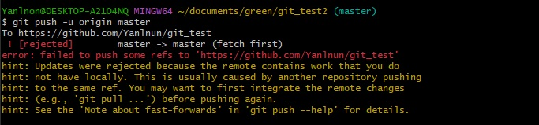
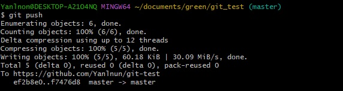

# git push -> error: failed to push some refs to '~~~'   hint: updates were rejected because the remote contains work that you do not have locally

원격저장소(git)에는 있지만,   로컬저장소(pc)에 없는 파일이 존재할경우 발생.

<strong>" git pull "</strong> 로 한번 업데이트를 해준다음 push 가능

